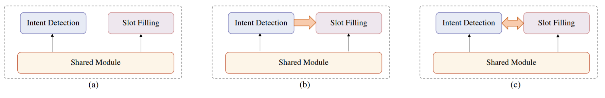
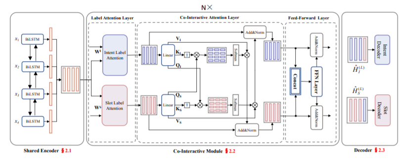
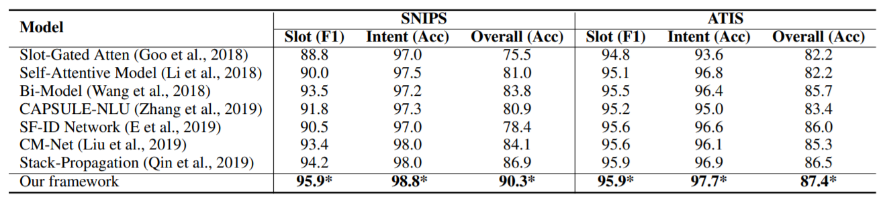

# A Co-Interactive Transformer for Joint Slot Filling and Intent Detection
This repository contains the PyTorch implementation of the paper: 

**A Co-Interactive Transformer for Joint Slot Filling and Intent Detection**. [Libo Qin](http://ir.hit.edu.cn/~lbqin/), [TaiLu Liu](https://github.com/labage), [Wanxiang Che](http://ir.hit.edu.cn/~car/chinese.htm), [bingbing Kang](https://github.com/kangbrilliant), [Sendong Zhao](https://sites.google.com/site/zhaosendong/), [Ting Liu](http://ir.hit.edu.cn/~liuting/).

If you use any source codes or the datasets included in this toolkit in your work, please cite the following paper. The bibtex are listed below:

In the following, we will guide you how to use this repository step by step.

## Architecture

## Results

## Preparation

Our code is based on PyTorch 1.2. Required python packages:

-   numpy==1.18.1
-   tqdm==4.32.1
-   torch==1.2.0

We highly suggest you using [Anaconda](https://www.anaconda.com/) to manage your python environment.

## How to run training:
1) python main_joint.py

## Change dataset:
1) Modify data_path in config.py

If you have any question, please issue the project or [email](478421198@qq.com) me and we will reply you soon.
